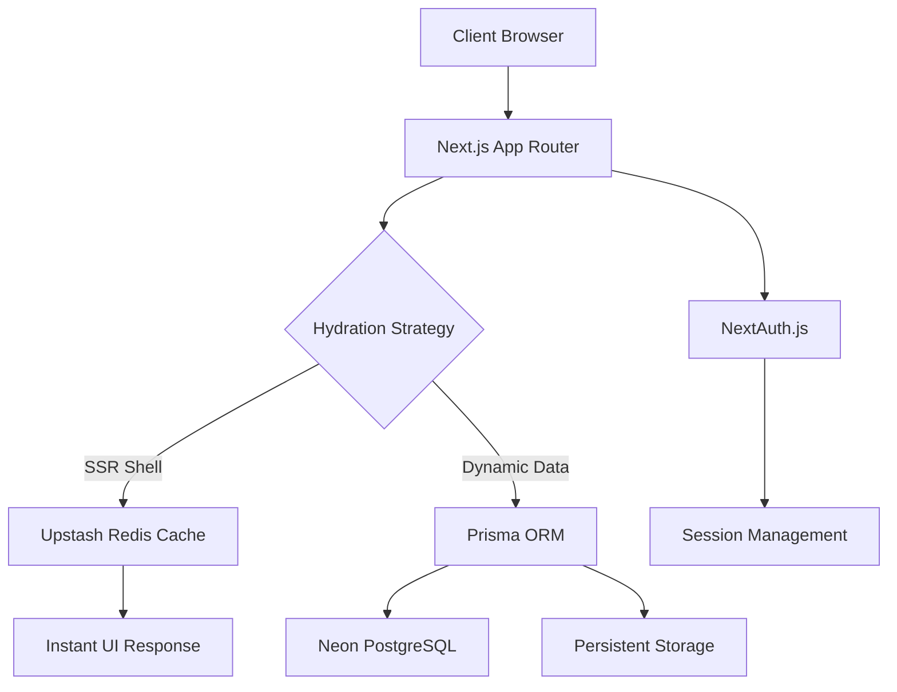
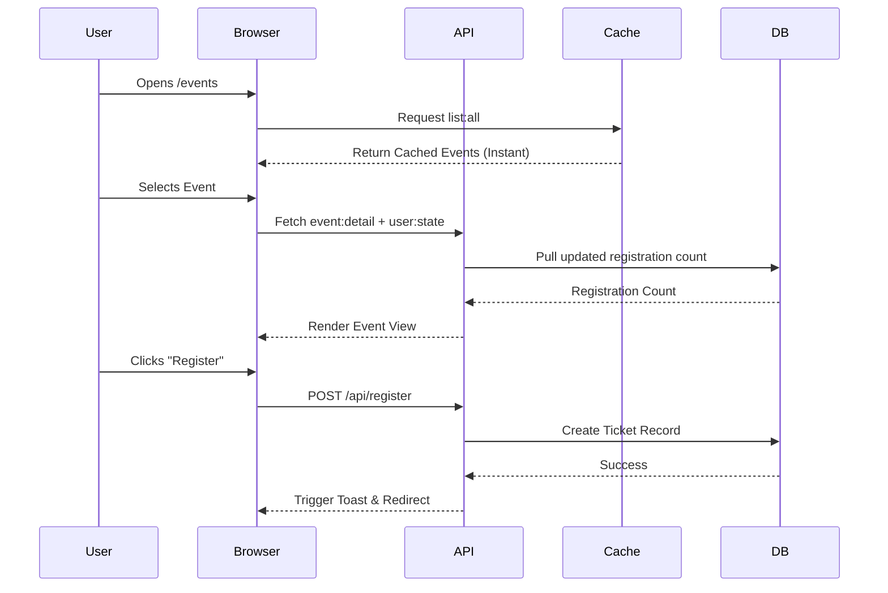

# EventOps (Command Center) 🏗️

**The high-performance event orchestration platform built for the modern editorial web.**

EventOps is an end-to-end ticketing and event management ecosystem designed with a "Performance-First" philosophy. It bridges the gap between organizers and attendees through a sharp, manga-inspired interface that prioritizes speed, accessibility, and operational precision.

---

## ⚡ Performance Architecture (Zero-Latency Shell)

Unlike traditional event platforms that suffer from database-induced latency, EventOps utilizes a **Parallel SSR/CSR Decoupling** strategy to achieve sub-second page loads:

| Feature | Strategy | Benefit |
| :--- | :--- | :--- |
| **Initial Load** | Redis-Backed SSR Shell | O(1) retrieval for metadata and capacity stats |
| **User State** | Asynchronous Hydration | Parallel fetching for registration and team status |
| **Connectivity** | Notification Shielding | 30s grace-cache to prevent DB connection exhaustion |
| **Discovery** | Multi-Tag Filtering | Optimized client-side filtering with server-side caching |

### 🛠️ System Flow


---

## 🎨 Core Pillars

### Editorial Manga Aesthetic
A distinctive design language featuring high-contrast monochrome accents, conic wisp gradients, and "Action Line" hero sections. The UI feels alive, responsive, and premium.

### 🛡️ Organizer Command Center
*   **Dynamic Event Creation:** Multi-step forms with integrated location pinning.
*   **Team Management:** Invite collaborators and manage permissions with real-time sync.
*   **Unified Messaging:** A centralized hub for organizer-to-attendee communication with instant status updates.
*   **Mobile Dashboard:** Optimized management view with "Events-First" priority and real-time stats.

### 📦 Attendee Experience
*   **Fluid Event Discovery:** Advanced filtering with mobile-responsive dropdowns.
*   **Instant Registration:** QR-coded digital tickets with seamless checkout flows.
*   **Favorites System:** Localized persistence for quick access to upcoming vibes.
*   **Team Dashboards:** Built-in support for Hackathons/Competitions with collaborative team management.

---

## 🚦 The Tech Stack

| Layer | Technology | Primary Role |
| :--- | :--- | :--- |
| **Framework** | Next.js 15+ (App Router) | Full-stack orchestration & SEO |
| **Language** | TypeScript | Type-safe development |
| **Styling** | Tailwind CSS 4.0 | Sharp-Editorial theme & responsiveness |
| **Database** | Prisma + Neon (PostgreSQL) | Reliable relational persistent storage |
| **Caching** | Upstash Redis | Low-latency state & list caching |
| **Auth** | NextAuth.js | Secure session-based authentication |

---

## 🏗️ Local Development

### 1. Requirements
*   Node.js (Latest LTS)
*   A PostgreSQL instance (Neon recommended)
*   A Redis instance (Upstash recommended)

### 2. Setup
```bash
# Clone and Install
git clone https://github.com/gauravag18/EventOps.git
cd EventOps
npm install

# Database Synchronization
npx prisma generate
npx prisma db push
```

### 3. Environment Configuration 🔑
Create a `.env` in the root directory with the following keys:

| Key | Description | Required |
| :--- | :--- | :--- |
| `DATABASE_URL` | Connection string for Neon/PostgreSQL | Yes |
| `REDIS_URL` | Upstash Redis connection URL | Yes |
| `NEXTAUTH_SECRET` | Secret key for session encryption | Yes |
| `STRIPE_SECRET_KEY` | Secret key for payment processing | Yes |
| `SMTP_HOST` | Host for outgoing notification emails | Yes |
| `SMTP_USER` | Email user for SMTP | Yes |
| `SMTP_PASS` | Email password for SMTP | Yes |

### 4. Run
```bash
npm run dev
```

---

## 🛤️ Application Workflow

### Event Discovery & Registration


---

## 📝 License
Licensed under the Apache License 2.0. Built with precision by the EventOps Team. 🏁
